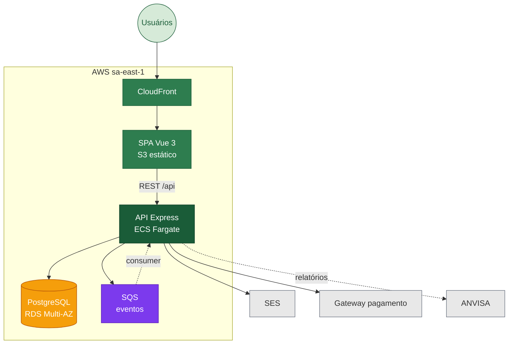

# CannaSYS 🌿

> ERP open-source para associações brasileiras de cannabis medicinal — do cultivo da planta à dispensação ao paciente, com rastreabilidade auditável.


---

## Sumário

- [Visão geral](#visão-geral)
- [Arquitetura](#arquitetura)
- [Stack tecnológica](#stack-tecnológica)
- [Estrutura do repositório](#estrutura-do-repositório)
- [Rodar localmente](#rodar-localmente)
  - [Pré-requisitos](#pré-requisitos)
  - [1. Clonar e instalar](#1-clonar-e-instalar)
  - [2. Subir o banco com Docker](#2-subir-o-banco-com-docker)
  - [3. Variáveis de ambiente](#3-variáveis-de-ambiente)
  - [4. Rodar as migrations](#4-rodar-as-migrations)
  - [5. Iniciar o backend](#5-iniciar-o-backend)
  - [6. Iniciar o frontend](#6-iniciar-o-frontend)
- [API Reference](#api-reference)
- [Módulos implementados](#módulos-implementados)
- [Variáveis de ambiente](#variáveis-de-ambiente-referência)
- [Testes](#testes)
- [Bounded Contexts](#bounded-contexts)
- [Decisões arquiteturais (ADRs)](#decisões-arquiteturais-adrs)
- [Roadmap](#roadmap)
- [Referências](#referências)

---

## Visão geral

O **CannaSYS** integra os 4 perfis envolvidos no atendimento (paciente, médico, farmacêutico, administrador) em um único sistema que cobre 6 bounded contexts e mantém a **cadeia de rastreabilidade exigida pela ANVISA**: cada frasco dispensado é rastreável até o lote de cultivo de origem.

---

## Arquitetura



---

## Stack tecnológica

### Backend
| Camada | Tecnologia |
|---|---|
| Runtime | Node.js 20 |
| Framework | Express 4 |
| Linguagem | TypeScript 5 |
| ORM | Sequelize 6 + sequelize-typescript |
| Banco | PostgreSQL 15 |
| Auth | JWT (jsonwebtoken) + bcrypt |
| Validação | Joi |
| Logs | Winston + daily-rotate-file |
| Docs | Swagger (swagger-jsdoc + swagger-ui-express) |
| Testes | Jest + Supertest |

### Frontend
| Camada | Tecnologia |
|---|---|
| Framework | Vue 3 (Composition API) |
| Build | Vite 5 |
| Estado | Pinia + pinia-plugin-persistedstate |
| Server state | TanStack Vue Query |
| UI | shadcn-vue (Reka UI) + Tailwind CSS 3 |
| Forms | vee-validate + Zod |
| HTTP | Axios |
| Roteamento | Vue Router 4 |
| i18n | vue-i18n |
| Gráficos | vue-chartjs + Chart.js |
| Testes | Vitest + Playwright |

---

## Estrutura do repositório

```
restapi-cannays/
├── src/                          ← Backend
│   ├── config/                   ← Variáveis de ambiente e configurações
│   ├── database/
│   │   ├── migrations/           ← Migrations Sequelize
│   │   └── models/               ← Modelos Sequelize
│   ├── interfaces/               ← Tipos e interfaces TypeScript
│   ├── middlewares/              ← Auth middleware + JWT service
│   ├── modules/
│   │   ├── auth/                 ← Cadastro e login (signup/signin)
│   │   ├── user/                 ← Perfil do usuário
│   │   └── cultivo/              ← CRUD de lotes de cultivo + transição de etapa
│   ├── routes/                   ← Roteador raiz (/api)
│   └── utils/                    ← Logger, error handler, swagger, custom-error
├── frontend/                     ← SPA Vue 3
│   ├── src/
│   │   ├── views/                ← 15 views da aplicação
│   │   ├── stores/               ← 6 stores Pinia
│   │   ├── components/           ← Componentes reutilizáveis
│   │   ├── composables/          ← Composables Vue
│   │   ├── router/               ← Vue Router
│   │   └── config/               ← Configurações de ambiente
│   └── tests/                    ← Testes Vitest + Playwright
├── docs/
│   ├── adrs/                     ← 5 Architecture Decision Records
│   ├── diagrams/                 ← Diagramas Mermaid (C4, sequence)
│   └── sad/                      ← Software Architecture Document
├── gold-plating/                 ← Terraform AWS, observability, chaos, DR (planejado)
├── docker-compose.yml            ← PostgreSQL local (dev)
├── docker-compose.cloudflared.yml ← Tunnels Cloudflare (exposição externa)
├── .env.development              ← Variáveis de ambiente para dev
└── .env.example                  ← Template de variáveis
```

---

## Rodar localmente

### Pré-requisitos

- [Node.js](https://nodejs.org/) >= 20
- [npm](https://www.npmjs.com/) >= 9 (vem com o Node)
- [Docker](https://www.docker.com/) e Docker Compose (para subir o banco)
- Git

---

### 1. Clonar e instalar

```bash
git clone https://github.com/gabrielgfc/restapi-cannays.git
cd restapi-cannays
npm install
```

---

### 2. Subir o banco com Docker

O projeto já inclui um `docker-compose.yml` pronto para desenvolvimento:

```bash
docker compose up -d
```

Isso sobe um PostgreSQL 15 com:
- **Host:** `localhost:5432`
- **Usuário:** `cannasys`
- **Senha:** `cannasys_dev`
- **Banco:** `cannasys_db`

Para verificar se subiu:
```bash
docker compose ps
```

Para parar:
```bash
docker compose down
```

---

### 3. Variáveis de ambiente

O arquivo `.env.development` já foi criado com os valores padrão alinhados ao Docker acima.  
Se precisar ajustar (porta diferente, banco externo etc.), edite diretamente:

```bash
# Abrir para editar
nano .env.development
```

Conteúdo padrão:
```env
PORT=5000
NODE_ENV=development
BASE_URL=http://localhost:5000

DB_PORT=5432
DB_USERNAME=cannasys
DB_PASSWORD=cannasys_dev
DB_NAME=cannasys_db
DB_HOST=localhost
DB_DIALECT=postgres

JWT_ACCESS_TOKEN_SECRET=cannasys_jwt_secret_dev_change_in_production
JWT_REFRESH_TOKEN_SECRET=cannasys_refresh_secret_dev_change_in_production
```

---

### 4. Rodar as migrations

Cria todas as tabelas no banco (`uuid_ossp`, `users`, `cultivo_lotes`):

```bash
npm run migration
```

---

### 5. Iniciar o backend

```bash
npm run dev
```

O servidor sobe em **`http://localhost:5000`**  
Documentação Swagger disponível em **`http://localhost:5000/api-docs`**

---

### 6. Iniciar o frontend

```bash
cd frontend
npm install
npm run dev
```

O frontend sobe em **`http://localhost:5173`** com proxy `/api` apontando para o backend.

Para instalar os browsers do Playwright (testes E2E, apenas uma vez):
```bash
npx playwright install
```

---

## API Reference

Base URL: `http://localhost:5000/api`

### Auth — `/api/auth`

| Método | Rota | Autenticação | Descrição |
|---|---|---|---|
| `POST` | `/auth/signup` | Não | Cria novo usuário |
| `POST` | `/auth/signin` | Não | Login, retorna JWT |

#### POST /auth/signup
```json
// Body
{
  "name": "Gabriel",
  "email": "gabriel@email.com",
  "password": "senha123"
}

// Response 201
{
  "message": "Successfully signed up",
  "data": { "id": "uuid", "name": "Gabriel", "email": "gabriel@email.com" }
}
```

#### POST /auth/signin
```json
// Body
{
  "email": "gabriel@email.com",
  "password": "senha123"
}

// Response 200
{
  "message": "Successfully signed in",
  "data": {
    "token": "eyJhbGciOi...",
    "user": { "id": "uuid", "name": "Gabriel", "email": "gabriel@email.com" }
  }
}
```

---

### User — `/api/user`

| Método | Rota | Autenticação | Descrição |
|---|---|---|---|
| `GET` | `/user/profile` | Bearer JWT | Retorna perfil do usuário autenticado |

---

### Cultivo — `/api/cultivo`

Todas as rotas exigem `Authorization: Bearer <token>`.

| Método | Rota | Descrição |
|---|---|---|
| `GET` | `/cultivo` | Lista todos os lotes de cultivo |
| `GET` | `/cultivo/:id` | Busca lote por ID |
| `POST` | `/cultivo` | Cria novo lote |
| `PUT` | `/cultivo/:id` | Atualiza lote |
| `PATCH` | `/cultivo/:id/etapa` | Transiciona etapa do lote |
| `DELETE` | `/cultivo/:id` | Remove lote |

---

## Módulos implementados

### `auth`
Cadastro e autenticação de usuários via JWT. Senhas armazenadas com bcrypt.

### `user`
Consulta de perfil do usuário autenticado.

### `cultivo`
CRUD completo de lotes de cultivo com máquina de estados por etapa (`etapa`). Todas as rotas protegidas por JWT.

---

## Variáveis de ambiente (referência)

| Variável | Descrição | Exemplo |
|---|---|---|
| `PORT` | Porta do servidor | `5000` |
| `NODE_ENV` | Ambiente | `development` |
| `BASE_URL` | URL base da API | `http://localhost:5000` |
| `DB_HOST` | Host do PostgreSQL | `localhost` |
| `DB_PORT` | Porta do PostgreSQL | `5432` |
| `DB_NAME` | Nome do banco | `cannasys_db` |
| `DB_USERNAME` | Usuário do banco | `cannasys` |
| `DB_PASSWORD` | Senha do banco | `cannasys_dev` |
| `DB_DIALECT` | Dialeto Sequelize | `postgres` |
| `JWT_ACCESS_TOKEN_SECRET` | Chave JWT de acesso | string segura |
| `JWT_REFRESH_TOKEN_SECRET` | Chave JWT de refresh | string segura |

> **Atenção:** nunca commite `.env.development` ou qualquer `.env` com segredos reais. O arquivo já está no `.gitignore`.

---

## Testes

### Backend
```bash
# Rodar todos os testes
npm test

# Modo watch
npm run test:watch
```

Cobre middlewares de auth (`auth.middleware.test.ts`, `jwt.service.test.ts`) e módulos de usuário e auth.

### Frontend
```bash
cd frontend

# Testes unitários (Vitest)
npm test

# Modo watch
npm run test:watch

# Testes E2E (Playwright)
npm run test:e2e
```

---

## Bounded Contexts

| # | Contexto | Status | Descrição |
|---|---|---|---|
| 1 | `auth` | ✅ Fase 1 | Autenticação e autorização |
| 2 | `user` | ✅ Fase 1 | Perfil e gestão de usuários |
| 3 | `cultivo` | ✅ Fase 1 | Lotes de cultivo e rastreabilidade |
| 4 | `producao` | 🟡 Fase 2 | Processamento e extração |
| 5 | `rh` | 🟡 Fase 2 | Recursos humanos |
| 6 | `interacao` | 🟡 Fase 2 | Dispensação ao paciente |

---

## Decisões arquiteturais (ADRs)

| ID | Decisão | Arquivo |
|---|---|---|
| ADR-0001 | Monorepo backend + frontend | [0001](docs/adrs/0001-monorepo-backend-frontend.md) |
| ADR-0002 | Migração React → Vue 3 (Composition API) | [0002](docs/adrs/0002-migracao-react-para-vue3.md) |
| ADR-0003 | shadcn-vue (Reka UI) + Tailwind | [0003](docs/adrs/0003-shadcn-vue-reka-ui.md) |
| ADR-0004 | Pinia + TanStack Vue Query | [0004](docs/adrs/0004-pinia-state-management.md) |
| ADR-0005 | Monolito modular por bounded contexts | [0005](docs/adrs/0005-monolito-modular-bounded-contexts.md) |

**Documento de Arquitetura de Software (SAD):** [docs/sad/sad.md](docs/sad/sad.md)  
**Diagramas Mermaid:** [docs/diagrams/](docs/diagrams/)

---

## Roadmap

| Fase | Escopo | Status |
|---|---|---|
| 1 | Backend `auth` + `user` + `cultivo` + Frontend scaffold (15 views, 6 stores) + Docs arquitetural | ✅ Concluída |
| 2 | Backend `producao` + `rh` + `interacao` + `configuracoes` | 🟡 Planejada |
| 3 | Gold-plating: Terraform AWS + observability + chaos + DR + custo | 🟡 Planejada |
| 4 | Pilot com associação parceira | 🟡 Planejada |

---

## Referências

- Bass, Clements, Kazman — *Software Architecture in Practice*, 4ª ed.
- Martin — *Clean Architecture*
- Newman — *Building Microservices*, 2ª ed.
- Nygard — *Release It!*, 2ª ed.
- ISO/IEC 25010:2011
- AWS Well-Architected Framework · C4 Model · WCAG 2.1 AA
- ANVISA RDC 327/2019 · LGPD Lei 13.709/2018
