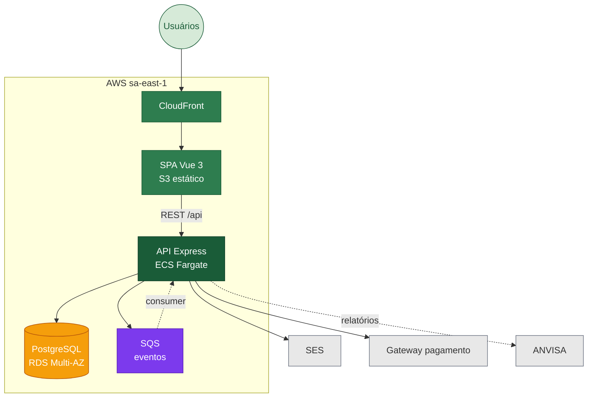

# CannaSYS 🌿

> ERP open-source para associações brasileiras de cannabis medicinal — do cultivo da planta à dispensação ao paciente, com rastreabilidade auditável.


## Visão executiva

O **CannaSYS** integra os 4 perfis envolvidos no atendimento (paciente, médico, farmacêutico, administrador) em um único sistema que cobre 6 bounded contexts e mantém a **cadeia de rastreabilidade exigida pela ANVISA**: cada frasco dispensado é rastreável até o lote de cultivo de origem.

## Estado por fase

| Fase  | Escopo                                                          | Status         |
| ----- | --------------------------------------------------------------- | -------------- |
| 1     | Backend `auth` + `user` + `cultivo`                             | ✅ Concluída   |
| 1     | Frontend scaffold + 15 views Vue 3 + 6 stores Pinia              | ✅ Concluída   |
| 1     | Documentação arquitetural (5 ADRs + SAD + 6 diagramas C4)       | ✅ Concluída   |
| 2     | Backend `producao` + `rh` + `interacao` + `configuracoes`        | 🟡 Planejada   |
| 3     | Gold-plating: Terraform AWS + observability + chaos + DR + custo | 🟡 Planejada   |
| 4     | Pilot com associação parceira                                   | 🟡 Planejada   |

## C4 Nível 2 — Containers



## Decisões arquiteturais (ADRs)

| ID                                                                 | Decisão                                                             |
| ------------------------------------------------------------------ | ------------------------------------------------------------------- |
| [0001](docs/adrs/0001-monorepo-backend-frontend.md)                | Monorepo backend + frontend em `restapi-cannays`                    |
| [0002](docs/adrs/0002-migracao-react-para-vue3.md)                 | Migração React → Vue 3 (Composition API)                            |
| [0003](docs/adrs/0003-shadcn-vue-reka-ui.md)                       | shadcn-vue (Reka UI) + Tailwind como sistema de componentes         |
| [0004](docs/adrs/0004-pinia-state-management.md)                   | Pinia (estado local) + TanStack Vue Query (server-state)            |
| [0005](docs/adrs/0005-monolito-modular-bounded-contexts.md)        | Monolito modular por 6 bounded contexts                             |

**Documento de Arquitetura de Software (SAD):** [docs/sad/sad.md](docs/sad/sad.md)
**Diagramas Mermaid fonte:** [docs/diagrams/](docs/diagrams/)

## Estrutura do repositório

```
restapi-cannays/
├── src/                  ← Backend Node 20 + Express + Sequelize (auth, user, cultivo)
├── frontend/             ← SPA Vue 3 + Vite + Pinia + vue-query + Tailwind + shadcn-vue
├── docs/                 ← Dossiê arquitetural (ADRs, SAD, diagramas)
└── gold-plating/         ← Terraform AWS, observability, chaos, runbook, DR, custos (planejado)
```

## Run local

**Pré-requisitos:** Node ≥ 20, pnpm ≥ 9, Postgres 15+ rodando local ou Docker, `.env` em `src/config`.

**Backend (porta 3000):**

```bash
npm install
npm run migration   # cria tabelas (uuid_ossp, users, cultivo_lotes)
npm run dev
```

**Frontend (porta 5173, proxy /api → 3000):**

```bash
cd frontend
pnpm install
pnpm exec playwright install   # uma vez
pnpm dev
```

Endpoints úteis: `GET http://localhost:3000/auth/health`, `POST /auth/login`, `GET /cultivo` (JWT).

## Decisão arquitetural central desta fase

**Monolito modular por bounded contexts** ([ADR 0005](docs/adrs/0005-monolito-modular-bounded-contexts.md)) — entrega tempo-ao-mercado com 5 devs, preservando o caminho para microsserviços via fronteiras `modules/<contexto>/`. Combinado com **migração para Vue 3** ([ADR 0002](docs/adrs/0002-migracao-react-para-vue3.md)) que unifica o stack do time.

## Referências

- Bass, Clements, Kazman — *Software Architecture in Practice*, 4ª ed.
- Martin — *Clean Architecture*
- Newman — *Building Microservices*, 2ª ed.
- Nygard — *Release It!*, 2ª ed.
- ISO/IEC 25010:2011
- AWS Well-Architected Framework · C4 Model · WCAG 2.1 AA
- ANVISA RDC 327/2019 · LGPD Lei 13.709/2018
