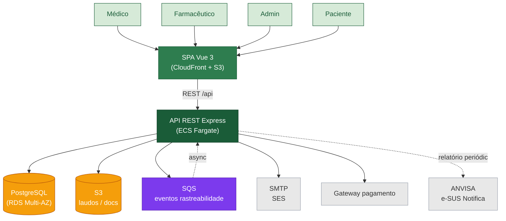

# Software Architecture Document — CannaSYS

**Versão:** 1.0 · **Data:** 2026-06-05 · **Status:** Aceito

## 1. Visão executiva

O **CannaSYS** é um ERP web para associações brasileiras de cannabis medicinal sem fins lucrativos. Cobre o ciclo completo: cultivo da planta → produção de óleo → controle de estoque → validação médico-farmacêutica → dispensação ao paciente. Diferencial: **rastreabilidade auditável** de cada frasco até o lote de origem, atendendo exigências da ANVISA e da LGPD.

**Estado atual (sprint 1):**
- Backend Node/Express/Sequelize com módulos `auth`, `user`, `cultivo` implementados
- Frontend Vue 3 + Vite com 15 views, 6 stores Pinia, vue-query, i18n pt-BR
- 5 ADRs aceitos definindo o stack
- Roadmap: módulos `producao`, `rh`, `interacao`, `configuracoes` no backend (próximos sprints)

## 2. Drivers arquiteturais (RNF → meta SMART → decisão)

| RNF                        | Meta SMART                                                | Decisão / Mecanismo                                              |
| -------------------------- | --------------------------------------------------------- | ---------------------------------------------------------------- |
| Disponibilidade            | ≥ 99.5%/mês (≤ 3h45min downtime)                          | ECS multi-AZ + RDS Multi-AZ ([ADR 0005](../adrs/0005-monolito-modular-bounded-contexts.md)) |
| Latência fila de validação | p95 < 300ms em 50 RPS                                     | Índices DB + cache vue-query no cliente ([ADR 0004](../adrs/0004-pinia-state-management.md)) |
| Acessibilidade             | WCAG 2.1 AA em 100% das telas                             | Reka UI primitives ([ADR 0003](../adrs/0003-shadcn-vue-reka-ui.md)) |
| Conformidade               | LGPD + rastreabilidade ANVISA                             | Log de auditoria + retenção 7 anos                               |
| Manutenibilidade           | Onboarding de novo dev em < 1 dia                         | Monorepo + bounded contexts ([ADR 0001](../adrs/0001-monorepo-backend-frontend.md), [0005](../adrs/0005-monolito-modular-bounded-contexts.md)) |
| Portabilidade UI           | Trocar framework sem tocar regras de negócio              | Stores + composables encapsulam I/O ([ADR 0002](../adrs/0002-migracao-react-para-vue3.md), [0004](../adrs/0004-pinia-state-management.md)) |
| Custo de infra             | ≤ USD 300/mês em dev, ≤ USD 900/mês em prod (ano 1)      | Fargate Spot + RDS reserved ([gold-plating/docs-extra/cost-optimization.md](../../gold-plating/docs-extra/cost-optimization.md)) |

## 3. Restrições

- **Compliance**: LGPD (dados sensíveis de saúde), Resolução ANVISA RDC 327/2019 (rastreabilidade), CFM (prescrições)
- **Stack**: Node 20 backend, Vue 3 frontend, Postgres, AWS
- **Time**: ≤5 devs full-stack, sem squad de plataforma
- **Budget**: USD 900/mês prod ano 1
- **Janela de manutenção**: domingos 02h–04h BRT

## 4. Decomposição — Bounded Contexts

| Contexto             | Responsabilidade                                                  | Owner Backend            | Owner Frontend             |
| -------------------- | ----------------------------------------------------------------- | ------------------------ | -------------------------- |
| Autenticação         | Login, JWT, refresh, recuperação senha                            | `modules/auth/`          | `views/auth/`              |
| Cultivo              | Lotes, transições de etapa, insumos, rastreabilidade origem       | `modules/cultivo/`       | `views/cultivo/`           |
| Produção             | Extrações, frascos, estoque, alerta crítico                       | `modules/producao/`      | `views/producao/`          |
| Recursos Humanos     | Membros, funções, escalas, atividades                             | `modules/rh/`            | `views/rh/`                |
| Interação Med-Farm   | Fila de validação, aprovação/ajuste/rejeição, thread              | `modules/interacao/`     | `views/interacao/`         |
| Configurações        | Associação, usuários, permissões, auditoria, integrações          | `modules/configuracoes/` | `views/configuracoes/`     |

## 5. C4 Nível 2 — Containers

## 6. Comunicação

- **Síncrono (REST)** entre SPA e API; entre serviços externos e API (SMTP, pagamento)
- **Assíncrono (SQS)** para eventos cross-contexto: `LoteColhido`, `ReceitaAprovada`, `FrascoDispensado`. Hoje implementado como queue in-memory; **substituível por SQS sem reescrita** (ADR 0005)
- **Contratos**: OpenAPI gerado via swagger-jsdoc no backend; types TS compartilhados via `packages/contracts/` (futuro)

## 7. Resiliência e disponibilidade

| Mecanismo                | Onde                                  | Atende                          |
| ------------------------ | ------------------------------------- | ------------------------------- |
| ECS Fargate multi-AZ     | 2 tasks em 2 AZs                      | Disponibilidade 99.5%           |
| RDS Multi-AZ + PITR      | Postgres com failover automático      | RPO 1 min, RTO 1h               |
| CloudFront + S3 estático | SPA cacheada na edge                  | Performance + custo             |
| Circuit breaker          | Adapters de integração externa (SMTP) | Falha de terceiro não derruba   |
| Healthcheck `/health`    | ALB target group                      | Tasks doentes substituídas      |
| Backups RDS              | Snapshot diário + PITR 7d             | DR (ver `dr-plan.md`)           |

## 8. Estratégia de cloud

AWS, região sa-east-1 (São Paulo) por latência ao público brasileiro. Topologia descrita em [`gold-plating/diagrams-extra/deployment-aws.mmd`](../../gold-plating/diagrams-extra/) e implementada em [`gold-plating/terraform/`](../../gold-plating/terraform/).

## 9. Atributos de qualidade — ISO/IEC 25010

| Característica           | Subcaracterística          | Mecanismo                                        |
| ------------------------ | -------------------------- | ------------------------------------------------ |
| Funcionalidade           | Adequação funcional         | Cobertura dos 6 módulos                          |
| Performance              | Comportamento temporal      | Índices DB, cache vue-query, CDN                 |
| Compatibilidade          | Interoperabilidade          | REST OpenAPI + eventos JSON Schema               |
| Usabilidade              | Acessibilidade              | Reka UI primitives, WCAG AA                      |
| Confiabilidade           | Disponibilidade 99.5%       | Multi-AZ + healthcheck                           |
| Confiabilidade           | Recuperabilidade            | RDS PITR + snapshot S3                           |
| Segurança                | Confidencialidade           | TLS, JWT, hash bcrypt, KMS                       |
| Segurança                | Auditabilidade              | Log de auditoria imutável (CloudTrail + tabela)  |
| Manutenibilidade         | Modularidade                | Bounded contexts                                 |
| Manutenibilidade         | Testabilidade               | Vitest unit + Playwright E2E                     |
| Portabilidade            | Adaptabilidade              | Container Fargate (move para EKS sem reescrita)  |

## 10. Riscos arquiteturais + mitigações

| Risco                                          | Impacto | Prob. | Mitigação                                                  |
| ---------------------------------------------- | ------- | ----- | ---------------------------------------------------------- |
| Vazamento de dados sensíveis (LGPD)            | Alto    | Baixo | KMS at-rest, TLS in-transit, mascaramento em logs          |
| Backend monolito vira gargalo                  | Médio   | Médio | Path-to-microservices preservado em bounded contexts       |
| Mudança regulatória ANVISA exige re-export     | Alto    | Médio | Camada de relatórios desacoplada                           |
| Custo de RDS Multi-AZ ultrapassa budget        | Médio   | Baixo | Alarm CloudWatch + auto-downgrade para single-AZ em dev    |
| Dependência de Reka UI (lib em 1.x)            | Baixo   | Médio | Copy-paste pattern reduz acoplamento; fork interno se vital |

## 11. Roadmap por sprint

| Sprint | Entrega                                                                 |
| ------ | ----------------------------------------------------------------------- |
| S1     | Backend `auth` + `user` + `cultivo`; Frontend scaffold + 15 views        |
| S2     | Backend `producao` (extração + frascos + estoque)                        |
| S3     | Backend `rh` + `interacao` (fila + validação)                            |
| S4     | Backend `configuracoes` (auditoria + permissões); integração paciente   |
| S5     | Terraform aplicado em dev; CI/CD; observability dashboards               |
| S6     | Testes E2E completos (Playwright); pilot com 1 associação                |

## 12. Referências

- Bass, L.; Clements, P.; Kazman, R. *Software Architecture in Practice*, 4ª ed., Addison-Wesley, 2021
- Martin, R. *Clean Architecture*, Pearson, 2017
- Newman, S. *Building Microservices*, 2ª ed., O'Reilly, 2021
- Nygard, M. *Release It!*, 2ª ed., Pragmatic Bookshelf, 2018
- Hohpe, G.; Woolf, B. *Enterprise Integration Patterns*, Addison-Wesley, 2003
- Pressman, R. *Engenharia de Software*, 9ª ed., McGraw-Hill, 2020
- ISO/IEC 25010:2011
- AWS Well-Architected Framework
- C4 Model — Simon Brown
- ANVISA RDC 327/2019; LGPD Lei 13.709/2018
